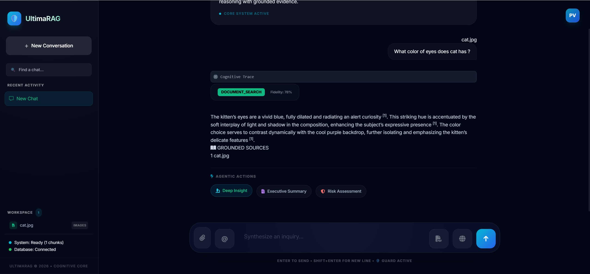
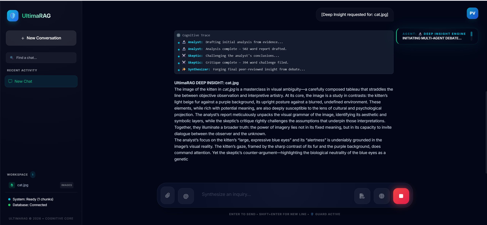
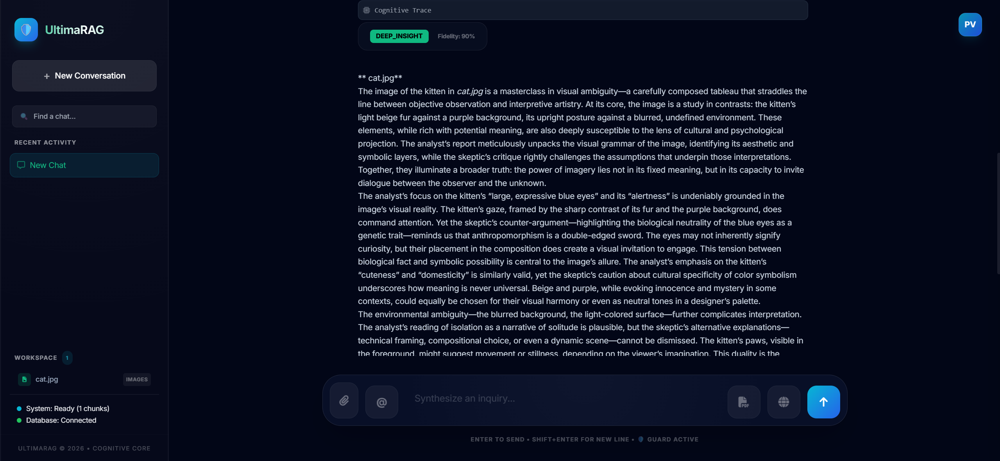
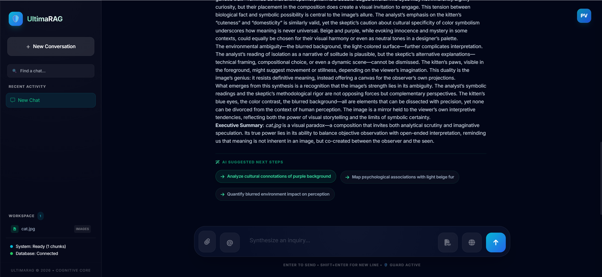
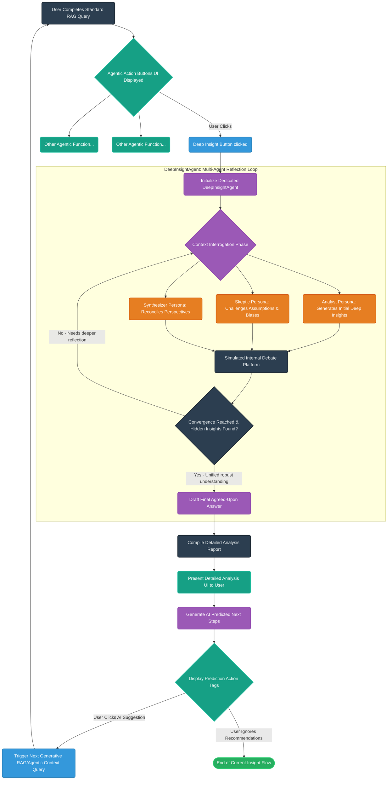

# Agentic Flow: Deep Insights

## Overview
This document explains the Deep Insights flow in SpandaOS, detailing the step-by-step process of how the **DeepInsightAgent** uses a Multi-Agent Reflection Loop to deeply interrogate the context and provide comprehensive, thoroughly analyzed answers to the user.

## Step-by-Step Flow

### Step 1
After the end of RAG based queries we will have three agentic buttons. One of the Button is 'Deep Insight'.

### Step 2
Once clicked, It triggers a dedicated DeepInsightAgent which runs a "Multi-Agent Reflection Loop." Rather than a single pass, it simulates a debate between different analytical personas (an Analyst, a Skeptic, and a Synthesizer) to deeply interrogate the context and find hidden insights before returning a final agreed-upon answer.

### Step 3
Once finished it generates a detailed analysis based on the debate and present it to user.

### Step 4
At the End of the response we gets AI Predicted next steps. if user clicks on any one of them then response based on that query will get generated (Currently n R&D phase about How to make them more useful)

---

## Agentic Flow: Deep Insights Architecture

Below is an extremely detailed flow diagram explaining the internal mechanics and sequence of the Agentic Flow for Deep Insights.

