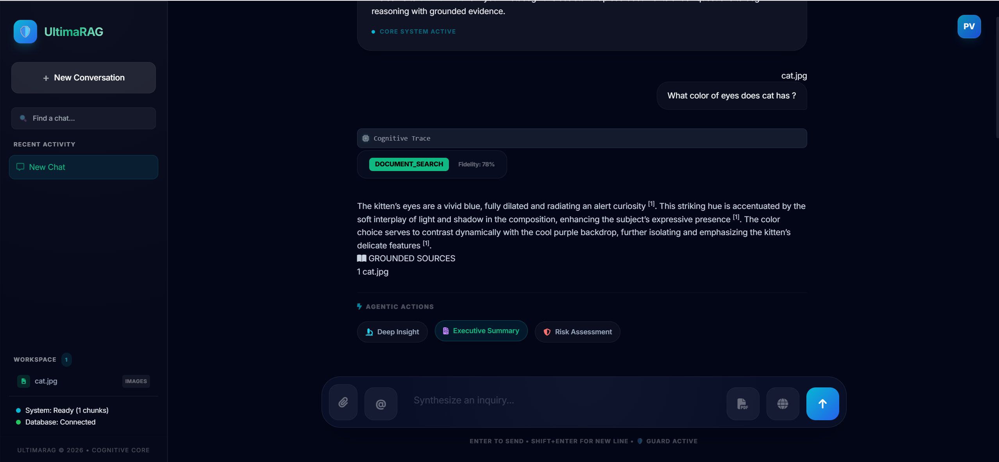
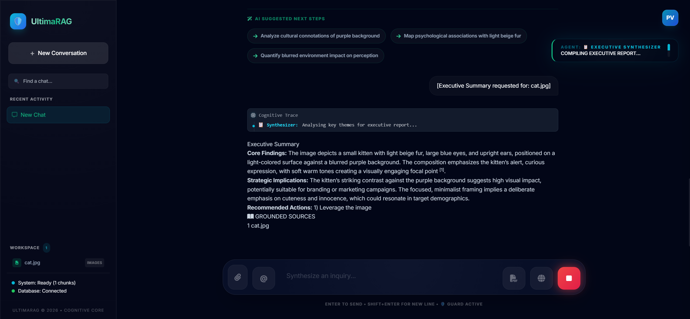
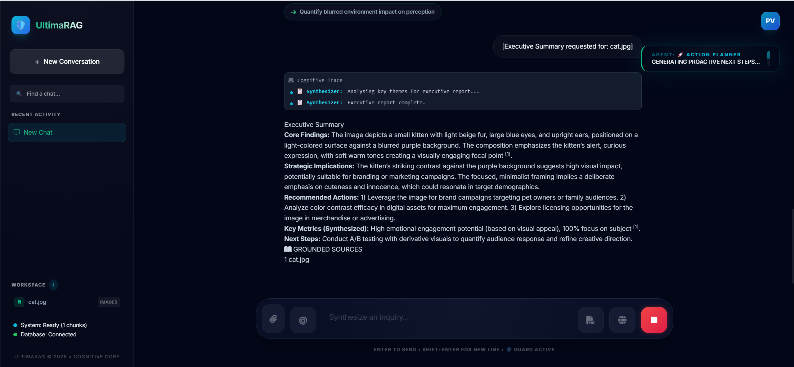
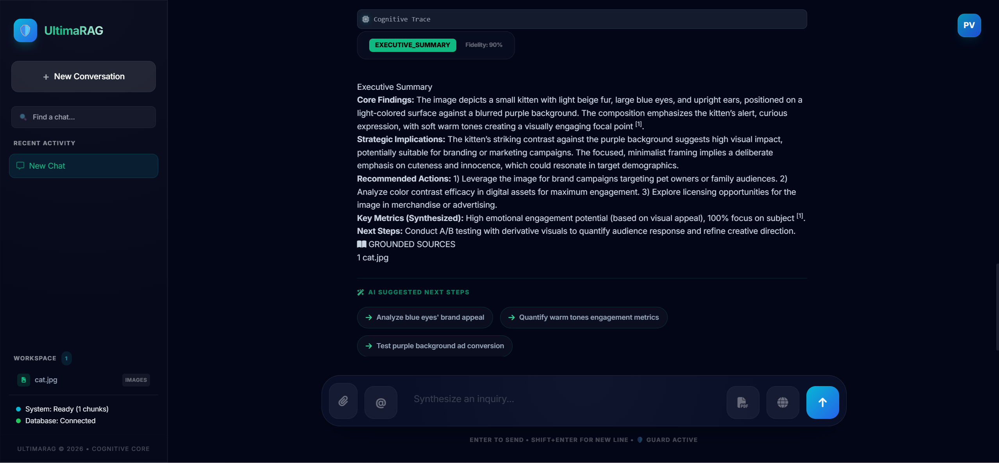
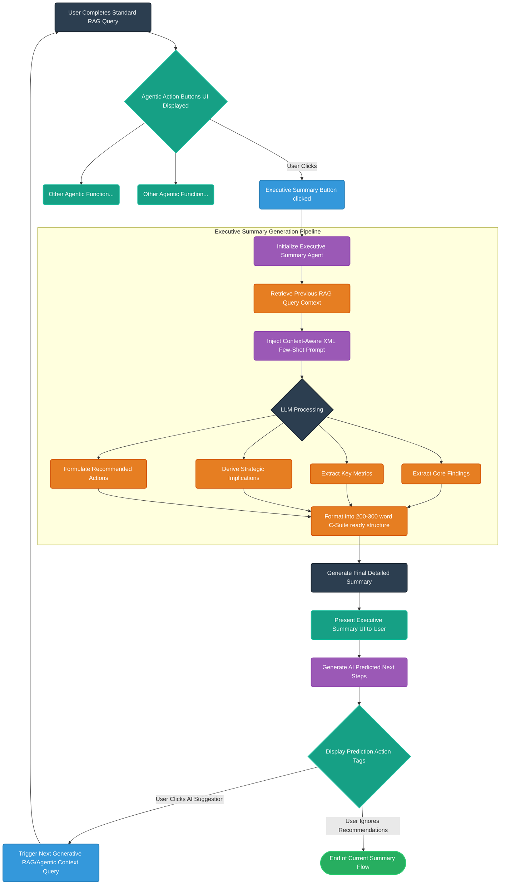

# Agentic Flow: Executive Summary

## Overview
This document outlines the **Executive Summary** flow in SpandaOS. It explains the step-by-step process of how the system transitions from a standard RAG query to utilizing a Context-Aware XML Few-Shot prompt to generate a structured, C-suite ready summary.

## Step-by-Step Flow

### Step 1
After the end of RAG based queries we will have three agentic buttons. One of the Button is 'Executive Summary'.

### Step 2
Once clicked, It uses a Context-Aware XML Few-Shot prompt to build an authoritative, C-suite ready summary. It guarantees a 200-300 word response divided into specific sections: Core Findings, Key Metrics, Strategic Implications, and Recommended Actions.

### Step 3
Once finished it generates a detailed Summary and present it to user.

### Step 4
At the End of the response we gets AI Predicted next steps. if user clicks on any one of them then response based on that query will get generated (Currently n R&D phase about How to make them more useful)

---

## Agentic Flow: Executive Summary Architecture

Below is a detailed Mermaid.ai flow diagram mapping out the complete Agentic Flow for the Executive Summary generation.

