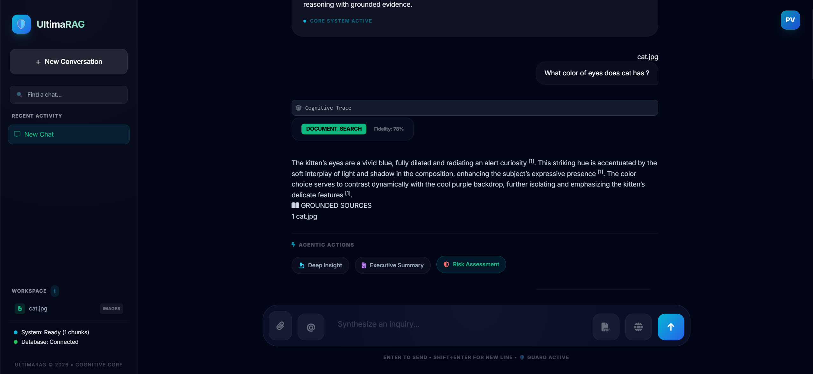
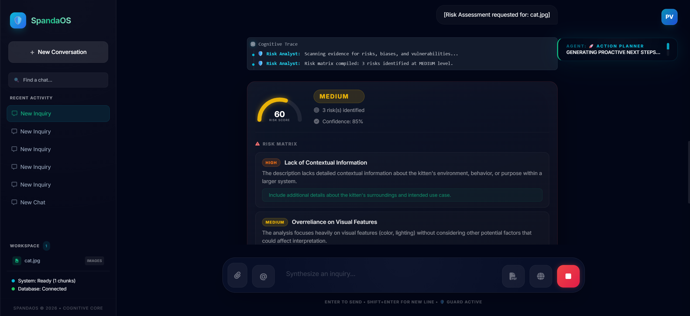
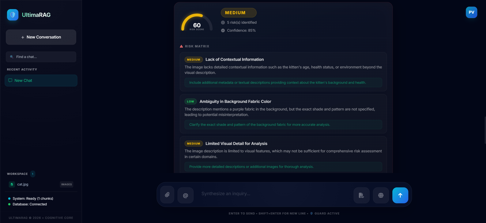
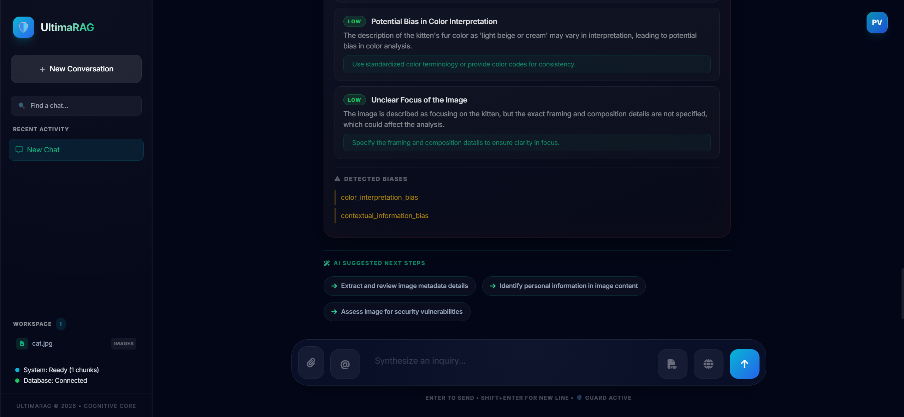
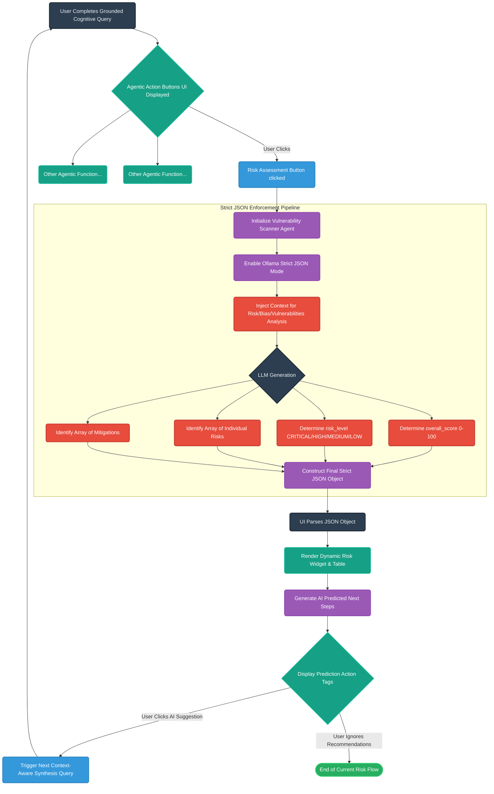

# Agentic Flow: Risk Assessment

## Overview
This document details the **Risk Assessment** flow in SpandaOS. It explains how the system transitions from a Grounded Cognitive Query to a dedicated "Vulnerability Scanner" that strictly outputs JSON data to render a dynamic risk widget and table.

## Step-by-Step Flow

### Step 1
After the end of Grounded Cognitive queries we will have three agentic buttons. One of the Button is 'Risk Assessment'.

### Step 2
Once clicked, It scans the semantic context specifically for risks, biases, and vulnerabilities (acting as a "Vulnerability Scanner"). It forces the LLM to output ONLY a strict JSON object (via Ollama JSON mode). This JSON contains an overall_score (0-100), a risk_level (CRITICAL, HIGH, MEDIUM, LOW), and an array of individual risks with mitigations. The UI then parses this JSON to render a dynamic risk widget.

### Step 3
Once finished it generates a detailed Risk score based Table and present it to user.

### Step 4
At the End of the response we gets AI Predicted next steps. if user clicks on any one of them then response based on that query will get generated (Currently n R&D phase about How to make them more useful)

---

## Agentic Flow: Risk Assessment Architecture

Below is a detailed Mermaid.ai flow diagram mapping out the complete Agentic Flow for the Risk Assessment.

