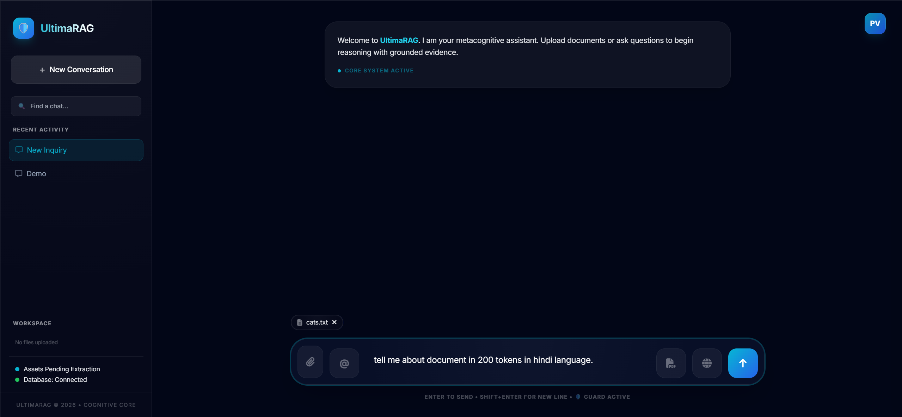
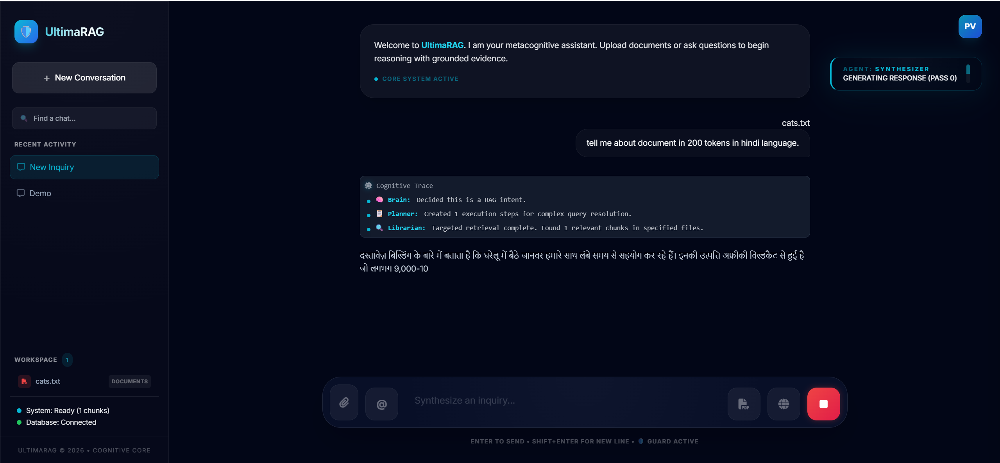
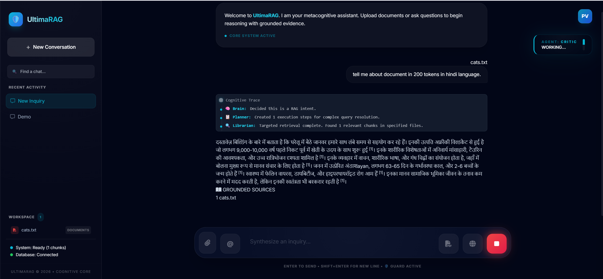
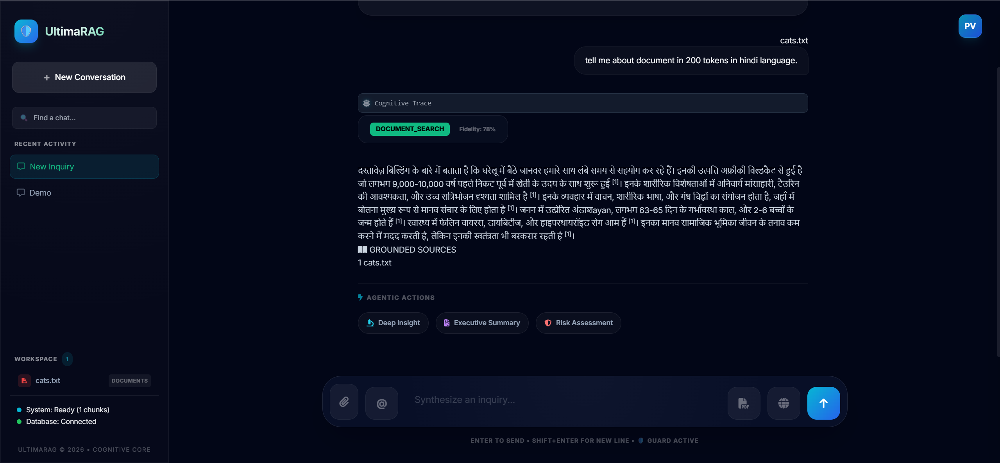
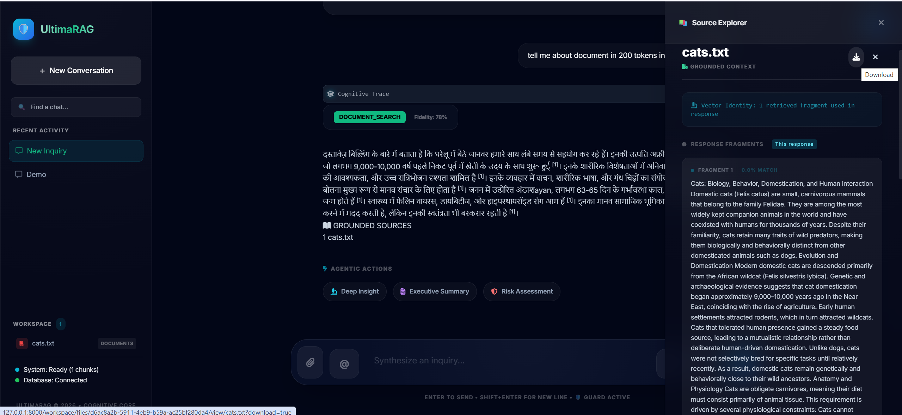
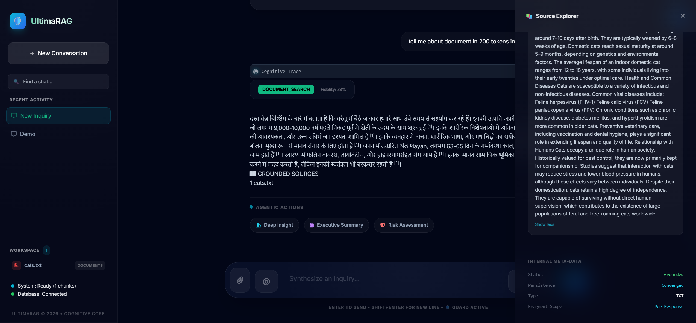
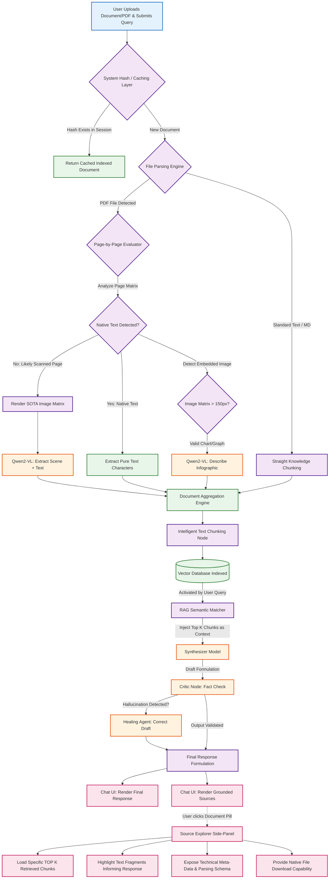

# SpandaOS Document Processing Workflow

This document provides a detailed, professional overview of the document processing capabilities within SpandaOS. It outlines the intelligent lifecycle of a text-based format or PDF, exploring how the system extracts, classifies, and makes both native text and embedded imagery fully searchable.

## Step 1: Document Selection, File Hashing, and Query
To initiate the document processing workflow, **we must select and upload a text, document, markdown, or PDF file and ask a query alongside the media upload.** This gives the AI the specific direction it needs to evaluate the text. Immediately upon ingestion, SpandaOS calculates a strict SHA-256 hash. This **Intelligent Caching** layer ensures that if you re-upload a previously processed document within the same session, the system instantly bypasses redundant extraction and retrieves the cached contextual data.

## Step 2: Intelligent Dual-Extraction (Native Text & Perception Fusion)
**The system will detect whether the file is pure text or OCR based, and based on that it will perform necessary steps to extract all the textual data available in the file and store them in chunks.**
SpandaOS actively analyzes each page dynamically:
1. **Native Text:** It securely pulls all embedded characters directly from the file formatting.
2. **Scanned Page Detection (SOTA):** If a page appears empty but contains visual data (i.e., a scanned book), the system dynamically routes that page to the **Qwen2-VL** multi-modal agent to perform a high-fidelity visual extraction, grabbing both text and layout descriptions.
3. **Embedded Image Parsing:** SpandaOS isolates pictures embedded within PDFs and independently analyzes each one using Vision perception so that infographics and charts inside reports are fully captured.

## Step 3: Knowledge Base Storage & RAG Context Retrieval
**Once text extraction gets done and the related textual data gets stored in the knowledge base, the application starts processing the user query with the RAG (Retrieval-Augmented Generation) flow.** By securely clustering and indexing the extracted chapters and descriptions into the vector database, lengthy documents transform into rapidly searchable knowledge. 
**Based on the user query, the RAG flow scrapes the related context and delivers it to the Synthesizer model to generate a proper response.** The RAG engine scans the hundreds or thousands of pages and retrieves only the exact paragraphs semantically related to the prompt, injecting them as grounded evidence.

## Step 4: Verification by Critic & Healing Agent
**Once the synthesizer finishes producing the response, the Critic and Healing agent checks and verifies whether the response is proper or not, and fills any missing gaps.** This is our highest level of accuracy assurance. Before the user ever sees the answer, the metacognitive critic evaluates the drafted response against the retrieved document text to strictly ensure the synthesizer did not hallucinate figures, dates, or logic.

## Step 5: Final Response & Grounded Sources UI
**Once a detailed response gets generated, we will get the document name listed below "Grounded Sources". If we click on the file name, the text will get loaded into the source explorer.** This enforces conversational traceability.
**Only the chunks responsible for response generation will be visible, and a maximum of TOP K chunks will get loaded.** This keeps the UI highly performant and user-focused, pointing the reader directly to the exact paragraphs that provided the answer, rather than forcing them to scroll a 300-page file.

## Step 6: Internal Meta-Data Review & Media Download
**At the end of the file, internal meta-data related to the file will be written.** This provides administrators with extreme transparency, surfacing system parameters such as chunk sizes, vector indexing hashes, semantic cluster counts, and file-parsing logic.
**The user can download this file as well.** The interface maintains secure access to the originally uploaded document, allowing researchers to quickly download the native asset to their local environment. 

---

## Detailed Document Processing Architecture Flow

The following Mermaid.js diagram provides an extremely detailed visualization of the physical SpandaOS document processing infrastructure, illustrating the intelligent routing between native text extraction and SOTA Vision perception.

