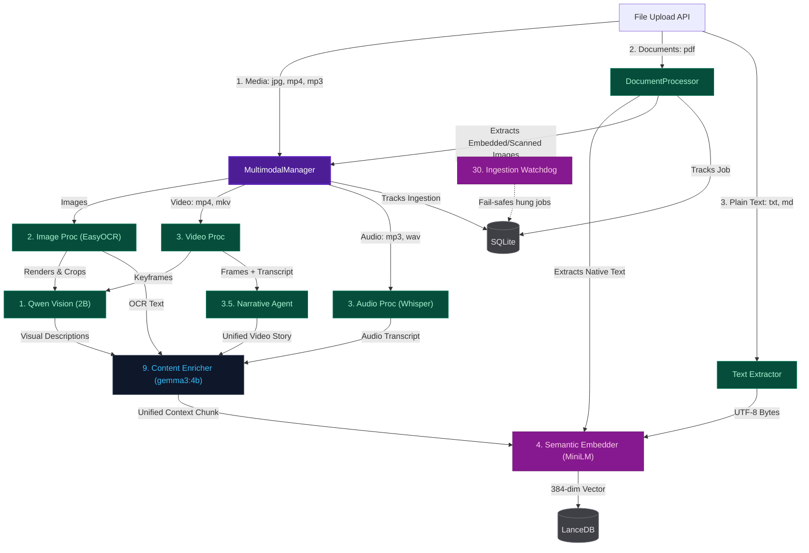
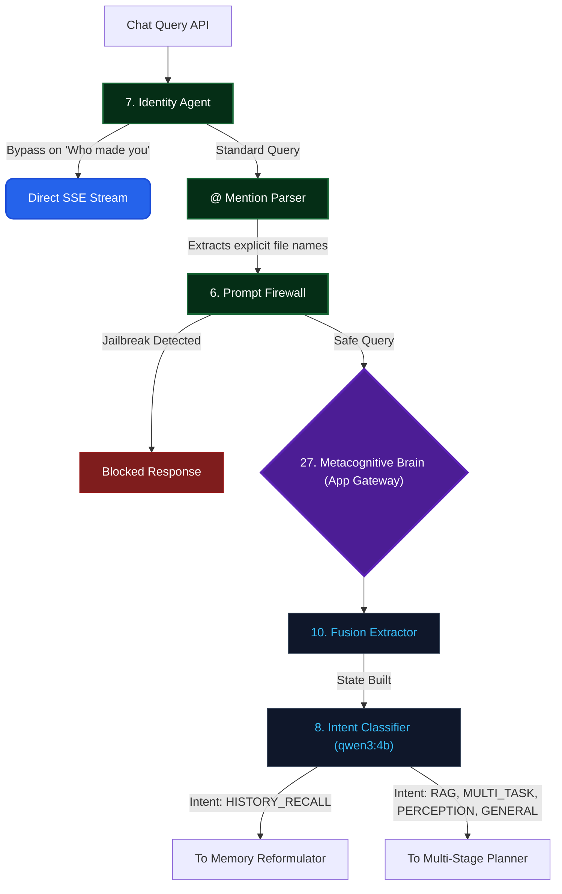
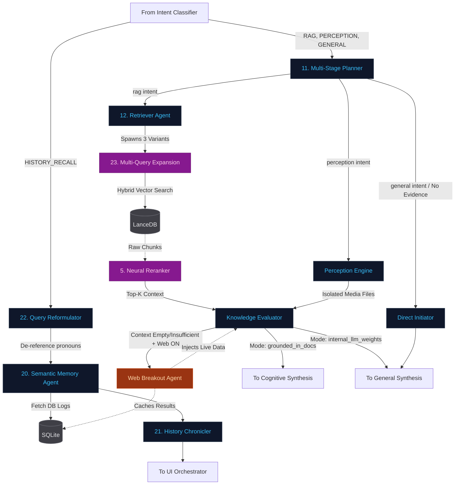
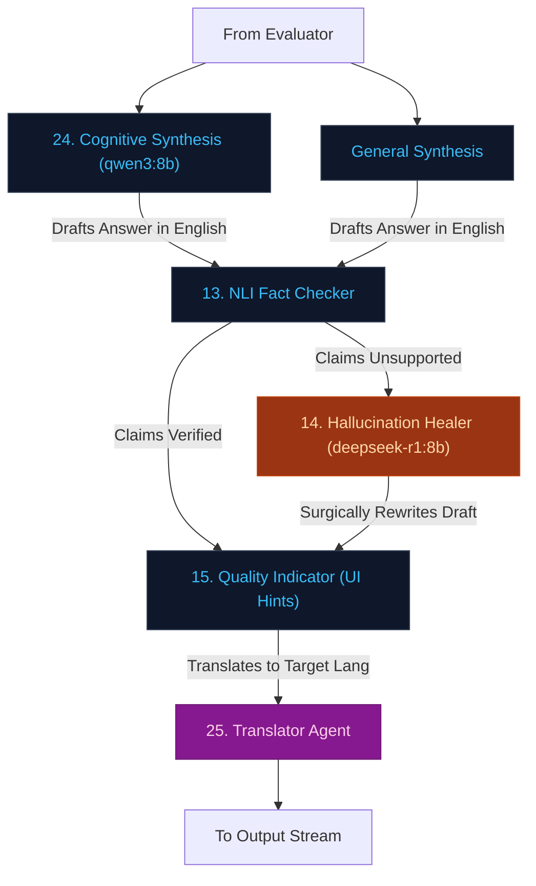
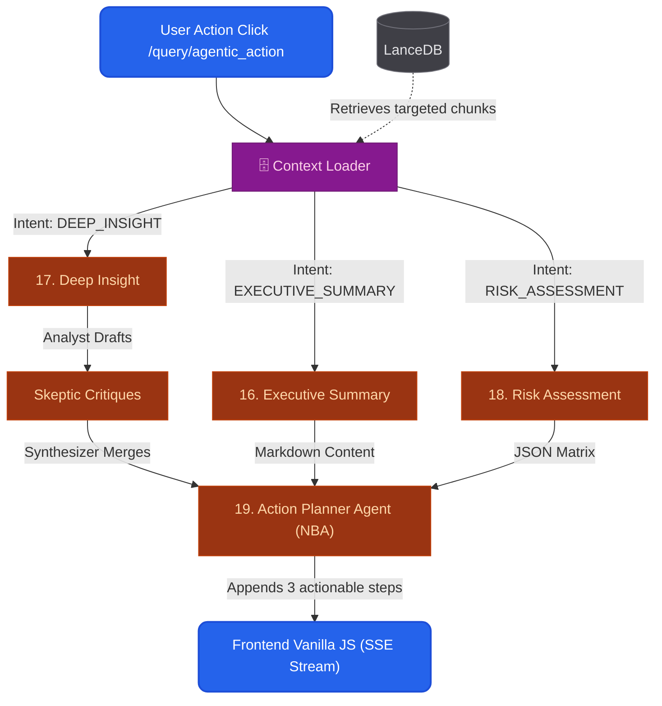
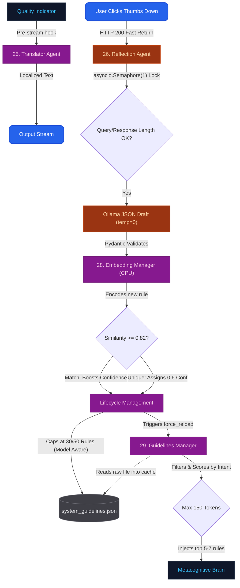
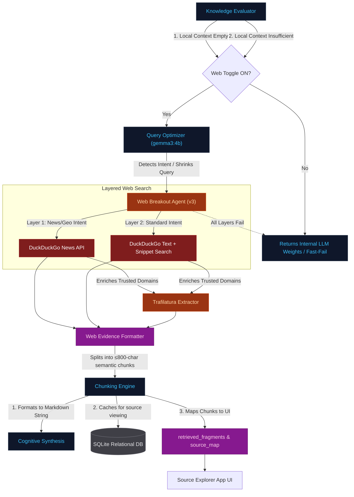

# SpandaOS: Architecture & Agent Connectivity Overview

This document provides a macroscopic view of the SpandaOS system, mapped directly from the source of truth (`AI_Agnets.md`). 

The diagram below maps all **30 distinct agents and subsystems** and traces the data flow from ingestion to final response.

## SpandaOS Connectivity Diagram

```mermaid
graph TD
    %% -------------------------------------------------------------------------
    %% STYLING
    %% -------------------------------------------------------------------------
    classDef user fill:#2563eb,stroke:#1d4ed8,color:#fff,stroke-width:2px,rx:10px,ry:10px;
    classDef system fill:#052e16,stroke:#166534,color:#fff,stroke-width:2px;
    classDef orchestrator fill:#4c1d95,stroke:#5b21b6,color:#fff,stroke-width:3px;
    classDef graphNode fill:#0f172a,stroke:#334155,color:#38bdf8,stroke-width:1px;
    classDef extractor fill:#064e3b,stroke:#047857,color:#a7f3d0;
    classDef external fill:#7f1d1d,stroke:#991b1b,color:#fff;
    classDef action fill:#9a3412,stroke:#c2410c,color:#fed7aa;
    classDef manager fill:#86198f,stroke:#701a75,color:#fbcfe8;
    classDef db fill:#3f3f46,stroke:#71717a,color:#e4e4e7,shape:cylinder;

    %% -------------------------------------------------------------------------
    %% ENTRY POINTS
    %% -------------------------------------------------------------------------
    User((User)):::user
    Upload[File Upload API]:::system
    Query[Chat Query API]:::system
    ActionClick[UI Action Button Click]:::action

    User -->|Uploads File| Upload
    User -->|Asks Question| Query
    User -->|Clicks Action| ActionClick

    %% -------------------------------------------------------------------------
    %% SECTION 1: THE SENSES (Background Ingestion)
    %% -------------------------------------------------------------------------
    subgraph Ingestion["Section 1: The Senses (Background Upload Processing)"]
        direction TB
        MM[MultimodalManager]:::orchestrator
        DocProc[DocumentProcessor]:::extractor
        Text[Text Extractor]:::extractor
        
        %% Extractors
        ImgProc["2. Image Processor (EasyOCR)"]:::extractor
        VidProc["3. Video Processor"]:::extractor
        AudProc["3. Audio Processor (Whisper)"]:::extractor
        
        %% Vision & Narrative
        Vision["1. Qwen Vision Agent"]:::extractor
        Narrative["3.5. Narrative Agent"]:::extractor
        
        %% Enrichment & Embed
        Enricher["9. Content Enricher (gemma3:4b)"]:::graphNode
        Embedder["4. Semantic Embedder (MiniLM)"]:::manager
        
        Upload -->|Media| MM
        Upload -->|pdf| DocProc
        Upload -->|txt, md| Text
        
        DocProc -->|Scanned Images / Graphs| MM
        DocProc -->|Native Text| Embedder
        Text -->|Raw Text| Embedder
        
        MM -->|Routes images| ImgProc
        MM -->|Routes mp4, mkv| VidProc
        MM -->|Routes mp3, wav| AudProc
        
        ImgProc -->|Extracted Image tiles| Vision
        VidProc -->|Sampled Keyframes| Vision
        VidProc -->|Compiled structured data| Narrative
        
        Vision -->|Image narrative| Enricher
        Narrative -->|Video narrative| Enricher
        AudProc -->|Audio transcript| Enricher
        ImgProc -->|Raw OCR Text| Enricher
        
        Enricher -->|Unified context| Embedder
    end

    %% -------------------------------------------------------------------------
    %% DATABASE
    %% -------------------------------------------------------------------------
    LanceDB[(LanceDB Vector Store)]:::db
    SQLiteDB[(SQLite Relational DB)]:::db
    Embedder -->|Saves 384-dim Vectors| LanceDB
    MM -->|Registers Job Status| SQLiteDB
    DocProc -->|Registers Job Status| SQLiteDB

    %% -------------------------------------------------------------------------
    %% SECTION 3: INFRASTRUCTURE (Autonomous)
    %% -------------------------------------------------------------------------
    subgraph Infrastructure["Section 3: Autonomous Infrastructure"]
        Watchdog["30. Ingestion Watchdog"]:::manager
        Watchdog -.->|Polls every 5m / Marks FAILED if stuck| SQLiteDB
    end

    %% -------------------------------------------------------------------------
    %% SECTION 2, PHASE 1: GATEWAY & SECURITY
    %% -------------------------------------------------------------------------
    subgraph API_Gateway["Phase 1: API Security Middleware"]
        Identity["7. Identity Agent"]:::system
        Mentions["@ Mention Parser"]:::system
        Firewall["6. Prompt Firewall Agent"]:::system
        
        Query --> Identity
        Identity -->|Bypass if identity keyword match| FinalResponse[Final Streamed Response]:::user
        Identity -->|If completely normal query| Mentions
        Mentions -->|Extracts explicit file names| Firewall
        Firewall -->|Blocks malicious/jailbreaks| Blocked[Rejected Response]:::external
    end

    %% -------------------------------------------------------------------------
    %% SECTION 2: METACOGNITIVE BRAIN (The LangGraph)
    %% -------------------------------------------------------------------------
    Brain{"27. Metacognitive Brain (Graph Orchestrator)"}:::orchestrator
    Firewall -->|If Safe| Brain
    
    subgraph LangGraph["Phase 2-4: Metacognitive Brain StateGraph"]
        direction TB
        
        Extractor["10. Universal Fusion Extractor"]:::graphNode
        Router["8. Intent Classifier (Router)"]:::graphNode
        Planner["11. Multi-Stage Planner"]:::graphNode
        
        %% History Path
        Reformulator["22. Query Reformulator"]:::graphNode
        MemoryMem["20. Semantic Memory Agent"]:::graphNode
        Chronicler["21. History Chronicler (gemma3:4b)"]:::graphNode
        
        %% Execution Branches
        Perception["Perception Engine"]:::graphNode
        Retriever["12. Retriever Agent (Multi-Query)"]:::graphNode
        DirectInit["Direct Initiator"]:::graphNode
        Reranker["5. Neural Reranker"]:::manager
        
        %% Evaluator & Synthesis
        Evaluator["Knowledge Evaluator"]:::graphNode
        WebBreakout["Web Breakout Agent"]:::action
        Synthesis["24. Cognitive Synthesis (qwen3:8b)"]:::graphNode
        GenSynthesis["General Synthesis Agent"]:::graphNode
        
        %% Verification Loop
        Critic["13. NLI Fact Checker (CrossEncoder)"]:::graphNode
        Healer["14. Hallucination Healer (deepseek-r1:8b)"]:::graphNode
        Quality["15. Quality Indicator (UI Hints)"]:::graphNode
        
        Brain --> Extractor
        Extractor -->|Builds State| Router
        
        %% Conditional Routing
        Router -->|Intent: HISTORY_RECALL| Reformulator
        Router -->|Intent: RAG, MULTI_TASK, PERCEPTION, GENERAL| Planner
        
        %% History Path Routing
        Reformulator -->|De-references pronouns| MemoryMem
        MemoryMem -->|Fetches past turns| Chronicler
        Chronicler -->|Direct Answer| Quality
        
        %% Planner Conditional Routing
        Planner -->|Mode: perception| Perception
        Planner -->|Mode: rag| Retriever
        Planner -->|Mode: direct| DirectInit
        
        %% Retrieval 
        LanceDB -.->|Hybrid Search| Retriever
        Retriever <-->|Scores & Filters| Reranker
        Retriever -->|Top-K Chunks| Evaluator
        Perception -->|Visual/Audio Assets| Evaluator
        
        %% Evaluator Logic
        Evaluator -->|If context empty/insufficient & Web ON| WebBreakout
        WebBreakout -.->|Injects Live Data| Evaluator
        WebBreakout -.->|Persists Search Results| SQLiteDB
        Evaluator -->|Sufficient Context| Synthesis
        Evaluator -->|Insufficient Context| GenSynthesis
        DirectInit -->|Forces| GenSynthesis
        
        %% Verification
        Synthesis -->|Draft Answer| Critic
        GenSynthesis -->|Draft Answer| Critic
        Critic -->|Confidence < Threshold| Healer
        Critic -->|Confidence >= Threshold| Quality
        Healer -->|Surgically Rewrites| Quality
        
        %% Translation (Final Step before streaming)
        Quality -->|Translates to Target Lang| Translator["25. Translator Agent"]:::manager
    end

    %% -------------------------------------------------------------------------
    %% ACTION PATH (Bypasses LangGraph)
    %% -------------------------------------------------------------------------
    subgraph Actions["Phase 4: Specialized UI Actions (Direct API)"]
        direction TB
        ContextLoader["🗄️ Context Loader"]:::graphNode
        ExecSum["16. Executive Summary Agent"]:::action
        DeepIns["17. Deep Insight (Analyst->Skeptic->Synthesizer)"]:::action
        RiskAss["18. Risk Assessment Agent (JSON Mode)"]:::action
        NBA["19. Action Planner Agent (NBA)"]:::action
        
        ActionClick["Action Button Click"]:::user --> ContextLoader
        LanceDB -.->|Context Embeddings| ContextLoader
        
        ContextLoader -->|Intent: EXECUTIVE_SUMMARY| ExecSum
        ContextLoader -->|Intent: DEEP_INSIGHT| DeepIns
        ContextLoader -->|Intent: RISK_ASSESSMENT| RiskAss
        
        ExecSum --> NBA
        DeepIns --> NBA
        RiskAss --> NBA
        
        NBA -->|Generates 3 Next Steps| FinalActions[Vanilla JS SSE Stream]:::user
    end

    %% -------------------------------------------------------------------------
    %% -------------------------------------------------------------------------
    %% LEARNING LOOP (Background / Async)
    %% -------------------------------------------------------------------------
    %% -------------------------------------------------------------------------
    %% LEARNING & POST-PROCESSING (Background / Async)
    %% -------------------------------------------------------------------------
    subgraph Learning["Phase 6: Continuous Learning & Localization"]
        direction TB
        Feedback["/query/feedback (Thumbs Down)"]:::user
        Reflector["26. Reflection Agent (Semaphore Lock)"]:::action
        OllamaGen["Ollama JSON Generator (temp=0)"]:::action
        EmbedManager["28. Embedding Manager (CPU)"]:::manager
        Dedup{"Similarity >= 0.82?"}
        Lifecyle["Lifecycle Mgmt (Retire/Cap)"]:::manager
        GuideManager["29. Guidelines Manager"]:::manager
        GuideJSON[("system_guidelines.json")]:::db
        Translator["25. Translator Agent"]:::manager
        
        Feedback -.->|Non-blocking schedule_reflection| Reflector
        Reflector -->|Passes Quality Gate| OllamaGen
        OllamaGen -->|Pydantic Validated Rule| EmbedManager
        EmbedManager -->|Encodes Rule| Dedup
        
        Dedup -->|Yes: Reinforce Rule| Lifecyle
        Dedup -->|No: Create New Rule| Lifecyle
        Lifecyle -->|Atomic os.replace| GuideJSON
        Lifecyle -->|Triggers force_reload| GuideManager
        
        GuideManager -.->|Caches Active Rules| GuideJSON
        GuideManager -->|Max 5-7 rules / 150 tokens| Synthesis
        
        %% Translation sits here as final localization output
        Quality -->|Translates Final Output| Translator
        Translator --> FinalResponse
    end
```

## Architectural Paths Overview

The diagram highlights four primary pathways in the system:

1. **The Ingestion Pipeline (Left):** Runs asynchronously. Files are scraped, processed multimodally, enriched into coherent narratives by `NarrativeAgent` and `ContentEnricher`, and embedded into `LanceDB`.
2. **The LangGraph Query Flow (Center):** The core reasoning loop. Queries pass through Middleware security (`PromptFirewall`), are routed by intent, gather evidence, synthesize a response, and then endure rigorous NLI Fact-Checking and Healing before reaching the user.
3. **The Specialized Action Flow (Right):** Quick, heavy-duty analytical tasks triggered via UI buttons (e.g., Risk Assessment). These bypass the complex LangGraph to operate directly on vector data, appending "Next Best Actions" (`Action Planner Agent`) at the end.
4. **The Continuous Learning Loop (Bottom):** Closing the loop. Downvotes trigger the `ReflectionAgent` which distills structural guidelines, perfectly deduplicates them via `EmbeddingManager`, and feeds them to the `GuidelinesManager` to permanently influence future `Cognitive Synthesis`.

***

# Focused Sub-Diagrams

To aid in explaining specific capabilities of the system, the master architecture is broken down below into 7 specialized, high-resolution views.

## 1. The Senses (Ingestion Pipeline)
This view shows how background extraction workers scrape raw files into vector evidence. Note how the `MultimodalManager` acts as the traffic controller for all media types.

## 2. Security Gateway & Intent Routing
This view explains how API requests are governed and how the LangGraph Brain decides which processing path to take.

## 3. Evidence Gathering & Memory Pathways
This view details the two primary retrieval mechanisms in LangGraph: History/Conversation Memory and RAG Vector Search.

## 4. Synthesis & Fact-Checking Loop
This view illustrates the core cognitive loop where the model drafts an answer, audits it via NLI (Natural Language Inference), and heals it if hallucinations are found.

## 5. Specialized Actions (Direct Vector APIs)
This view shows how specific UI buttons bypass the LangGraph logic entirely to run heavy-duty direct API sweeps over LanceDB.

## 6. Continuous Learning & Feedback
This view maps the closed-loop system where negative user feedback permanently rewrites the behavioral guidelines for the system.

## 7. Web Search Agent (Live Data Breakout)
This view isolates the conditional flow of the `Web Breakout Agent`. It details how SpandaOS determines when to break out to the live web, the fallback mechanisms used, and how web results are persisted and synthesized.

