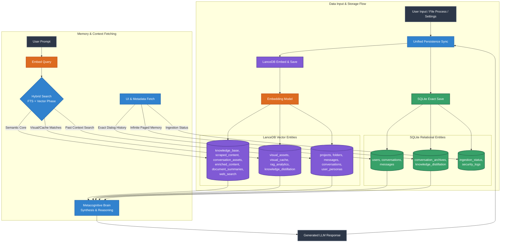

# SpandaOS Database Architecture

SpandaOS features a **dual-database architecture** designed to bridge the gap between traditional structured data requirements (like UI rendering and strict relational histories) and the complex, high-dimensional memory needs of an agentic intelligence system.

This architecture fundamentally relies on two database layers:
1. **LanceDB (Vector Native Storage)**: The semantic brain of the system. Stores high-dimensional vectors, extensive metadata, and enables fast nearest-neighbor / hybrid searches.
2. **SQLite / PostgreSQL (Relational Storage)**: The structural spine of the application. Tracks user profiles, deterministic chat history, UI states, and robust relationships between entities.

---

## 1. LanceDB Vectors & Schema (`src/core/database.py`)

LanceDB is responsible for semantic understanding, contextual retrieval (RAG), and agentic memory capabilities. It relies on a Centralized Schema Registry using `pyarrow`.

### Core Tables

| Table Name | Description | Key Fields / Schema |
| :--- | :--- | :--- |
| **`projects`** | Organizational containers for workspaces. | `id`, `name`, `description`, `color_code`, `global_instructions`, `created_at` |
| **`folders`** | Hierarchical structures within projects. | `id`, `project_id`, `parent_folder_id`, `name`, `created_at` |
| **`conversations`** | Vector-enriched conversation metadata block. | `id`, `project_id`, `folder_id`, `user_id`, `name`, `chunks_count`, `assets_count`, `is_archived`, `created_at` |
| **`messages`** | Individual message instances stored with embeddings for contextual lookup. | `id`, `conversation_id`, `role`, `content`, **`vector`** (Float32), `state` (e.g., ACTIVE, PAGED), `token_count` |
| **`user_personas`** | Agent customization instructions and tone per user. | `user_id`, `tone_settings`, `preferred_language`, `instruction_profile` |

### RAG & Knowledge Tables

| Table Name | Description | Key Fields / Schema |
| :--- | :--- | :--- |
| **`knowledge_base`** | Core RAG memory. Stores text chunks and vectors. | `id`, `conversation_id`, `file_name`, `text`, **`vector`**, `metadata` |
| **`conversation_assets`** | Metadata regarding uploaded documents/files within a chat. | `id`, `conversation_id`, `file_hash`, `file_path`, `file_type`, `summary` |
| **`scraped_content`** | Raw scraped content from websites or documents. | `id`, `file_id`, `content`, `sub_type`, `chunk_index`, `metadata` |
| **`web_search_knowledge`**| Context extracted from the Web Agent Breakouts. | `id`, `conversation_id`, `query`, `url`, `title`, `text`, **`vector`** |
| **`enriched_content`** | Synthesized/enriched versions of raw scrapes via intelligence layer. | `id`, `original_content`, `enriched_content`, `processing_status`, `rewriter_model` |
| **`document_summaries`** | High-level synthesis of whole documents. | `id`, `conversation_id`, `file_name`, `summary_type`, `content` |

### Multi-modal & Analytics

| Table Name | Description | Key Fields / Schema |
| :--- | :--- | :--- |
| **`visual_assets`** | Stores vision-model interpretations and visual embeddings. | `id`, `project_id`, `conversation_id`, `file_name`, **`vector`** (512D) |
| **`visual_cache`** | Tracks processed video frames for localized deduplication. | `id`, `video_id`, `variance_score`, `frame_id` |
| **`rag_analytics`** | Quality tracking metrics for RAG responses. | `message_id`, `score_groundedness`, `score_relevancy`, `score_utility` |
| **`knowledge_distillation`**| Phase 2 tier: extracted hard facts with confidence scores. | `id`, `conversation_id`, `extracted_fact`, `domain`, `confidence` |

---

## 2. Relational Schema (`src/data/database.py`)

SQLite operates as the deterministic, zero-config relational store powering the UI, handling hierarchical ownership, and providing traditional CRUD endpoints. 

| Table Name | Description | Columns |
| :--- | :--- | :--- |
| **`users`** | Tracks application users and their settings. | `user_id` (PK), `user_created_at`, `settings_json` |
| **`conversations`** | Tracks conversational lineage and parent ownership. | `conversation_id` (PK), `user_id` (FK), `title`, `is_archived`, `model_config`, timestamps |
| **`messages`** | Main dialogue table supporting branching (`parent_message_id`). | `message_id` (PK), `conversation_id` (FK), `parent_message_id` (FK), `role`, `content`, `metadata_json`, `feedback_score` |
| **`conversation_archives`**| Supports "Infinite Chat Memory" by storing summarized past context. | `archive_id` (PK), `conversation_id` (FK), `chunk_index`, `compressed_content`, `covered_message_ids` |
| **`knowledge_distillation`**| Semantic memory linking extracted facts to conversations. | `fact_id` (PK), `conversation_id` (FK), `extracted_fact`, `domain`, `confidence` |
| **`ingestion_status`** | System watchdog keeping track of offline file ingestion processes. | `id` (PK), `file_name`, `status`, `last_chunk_index`, timestamps |
| **`security_logs`** | Prompt Injection security monitoring logs. | `id` (PK), `conversation_id`, `raw_payload`, `threat_vector`, `created_at` |

---

## 3. Data Flow Diagram

The following Mermaid diagram outlines the "Unified Persistence" concept and the overall execution flow from Input routing to RAG retrieval and Storage sync.

## How It Works

1. **Unified Storage (Ingestion)**:
   - When the user sends a message or drops a file, the `add_message_unified` (or asset upload) function triggers.
   - **SQLite** instantly receives the structurally strict data—securing exactly how the UI will render the conversation history, branching, and feedback endpoints.
   - **LanceDB** runs the data through the `get_embedder()` model, breaks it into cognitive chunks/vectors, and logs it into tables like `knowledge_base` or `messages` for semantic similarity targeting.

2. **Hybrid Fetching (Retrieval)**:
   - When a user asks a query, SpandaOS doesn't solely rely on conversational text. The query is vectorized.
   - LanceDB runs a **Hybrid Search** (combining Full-Text Search [BM25] with Semantic Vector Search) against `knowledge_base`, `messages`, and `web_search_knowledge`.
   - Simultaneously, SQLite supplies exact deterministic dialog histories and loads "Paged" memory limits from `conversation_archives`.

3. **Continuous Agentic Cycles**:
   - The Metacognitive Brain reads from *both* databases, creating an incredibly rich context window, formatting the final answer, and piping the new `Assistant` response back into the **Unified Sync** loop.
